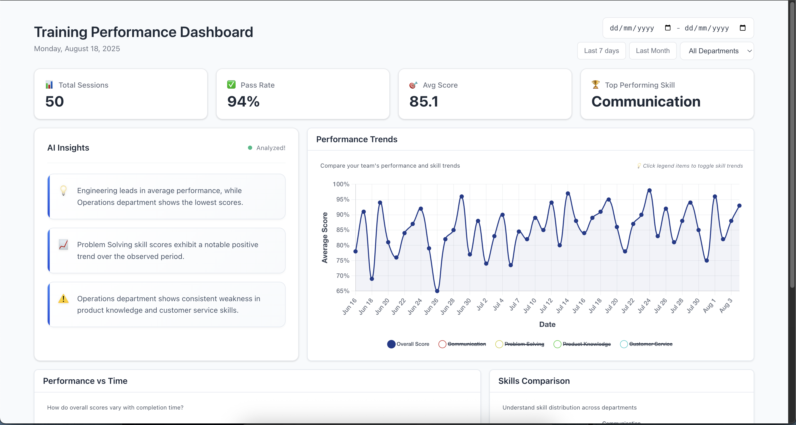
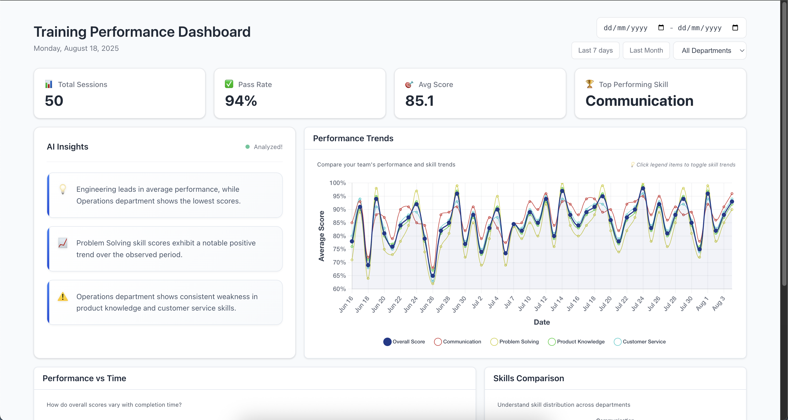
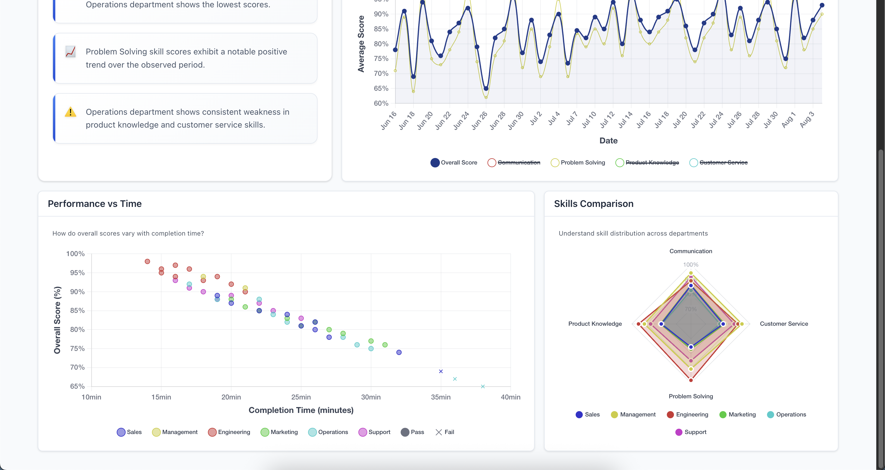
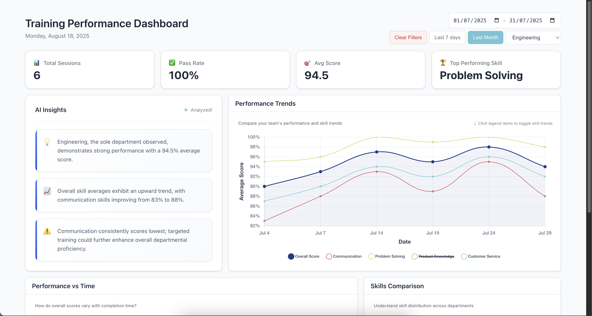
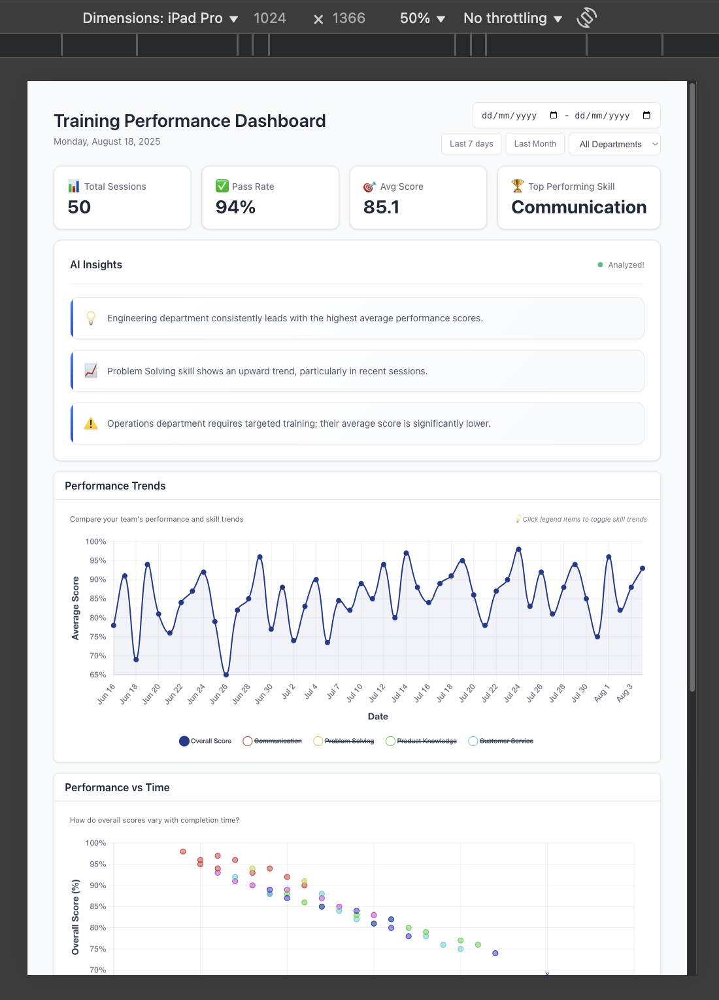
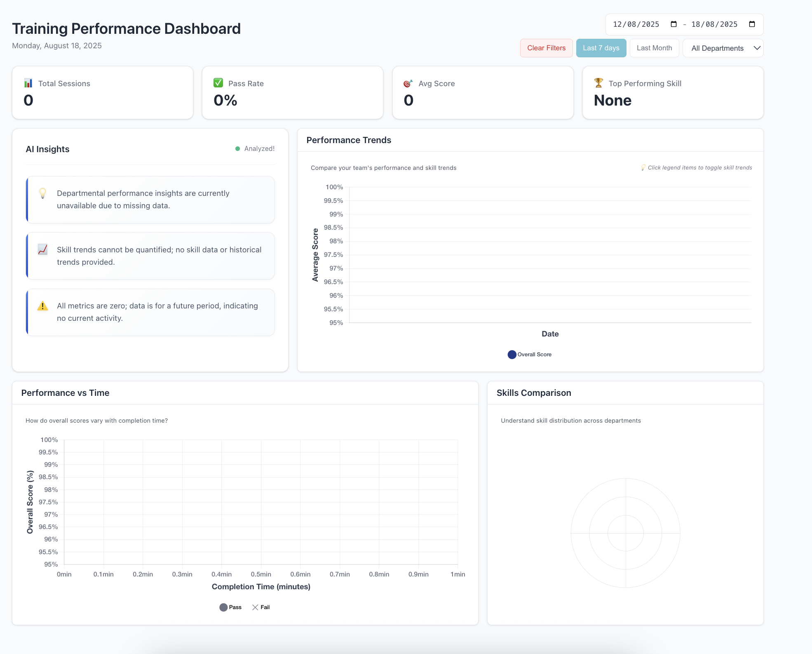

# Training Performance Dashboard
## Overview
This is a fullstack (Vue 3 + Express) training performance dashboard built for Attensi's technical assessment. The application visualises training data from gamified simulations, providing managers with actionable insights through interactive charts and AI-generated recommendations.

## Getting Started
Version preferences:
```
node: v22.18.0
npm: 10.9.3
```
#### Installation and env setup (root directory):
```
# install packages
npm i

# copy the backend .env.example to .env
cp backend/.env.example backend/.env
```
The  `.env.example` contains a free tier `GEMINI_API_KEY`.
Alternatively you can get your own free API key [here](https://aistudio.google.com/apikey).

#### Running the application (root directory):
```
# start frontend and backend:
npm run dev

# alternatively, run seperately
npm run dev:backend
npm run dev:frontend
```

## Design Decisions
**Tech Stack** I chose Vue 3 over React to align with Attensi's tech stack preference and my own eagerness to learn. For visualisations, some quick research determined that Chart.js offered the best balance between development speed/experience, and desired features. After evaluating D3 and other libraries, Chart.js provided the interactive features and smooth animations I wanted without the complexity overhead. I used TanStack Query for data fetching for out the box loading and error states alongside cached query data.
I built the backend with Express.js due to simplicity and my familiarity with RESTful APIs. Both the frontend and backend made use of TypeScript due to both my own and Attensi's preference for type safety and inference.

**AI Implementation** I implemented Option A (Natural Language Insights) using Google's Gemini API for its free tier API key and reliable performance. The goal was generating clean, actionable summaries that training managers could immediately understand and act upon. Rather than technical jargon, the AI produces human-readable insights like with specific recommendations and allows for instant key insights.

**UI/UX Approach** I wanted my dashboard to be simple with clean UI, while conveying meaningful information. The dashboard follows an intuitive, card-based layout that prioritises information hierarchy. Key metrics are prominently displayed at the top, followed by detailed visualisations below. I used a professional colour scheme with subtle animations and hover interactions to make data exploration engaging. The radar chart for skills comparison and scatter plot for performance vs completion time provide intuitive ways to spot patterns and outliers. The interactive legend allows managers to get a deeper understanding from each chart alone. 

**Architecture Decisions** I structured the backend with separate controllers for insights and AI insights and utility files to keep the logic separated and logical. The frontend uses dedicated components for each chart type and shared composables for data filtering logic. This component-based approach made the codebase maintainable and allowed for easy reusability.

**Trade-offs and Constraints** Given the time constraints, I prioritised core functionality and user experience over comprehensive testing. I hard-coded the skill categories based on the provided sample data rather than making them fully dynamic. I was happy to spend a bit more time to learn and understand Vue while creating a polished dashboard.

**Data Presentation** The visualisation choices focus on actionable insights. Line charts show trends over time, the radar chart makes skill comparisons intuitive across departments, and the scatter plot reveals the relationship between performance and completion time. Interactive filters allow users to go deeper into specific time periods, departments and even skills, making the dashboard practical for real-world training management scenarios.

The overall design emphasised simplicity and clarity across development and UI/UX, ensuring training managers can quickly extract meaningful insights without technical expertise.


## Screenshots





